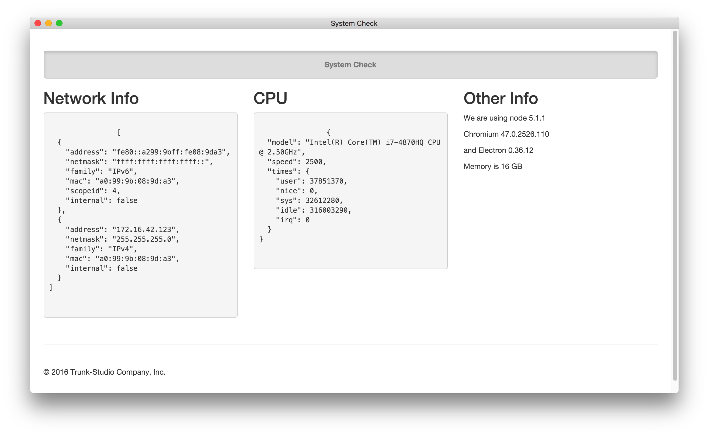
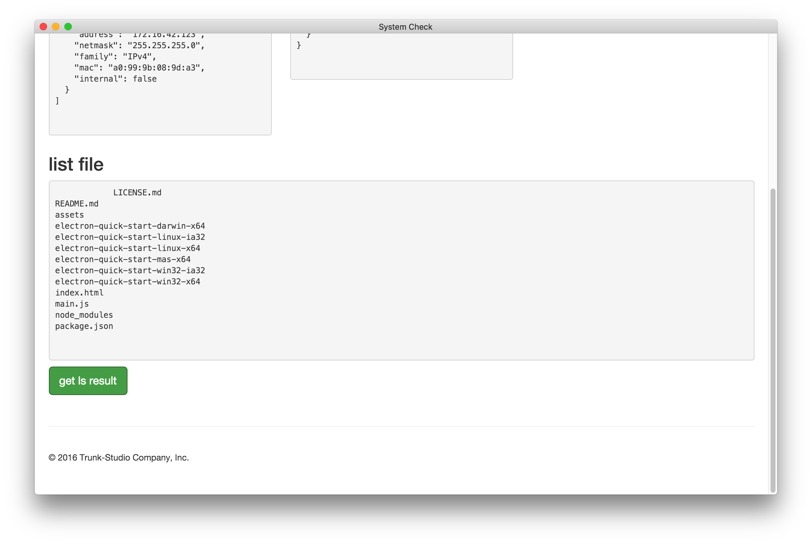
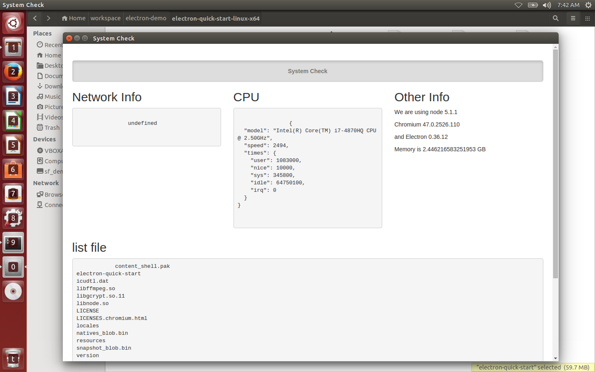
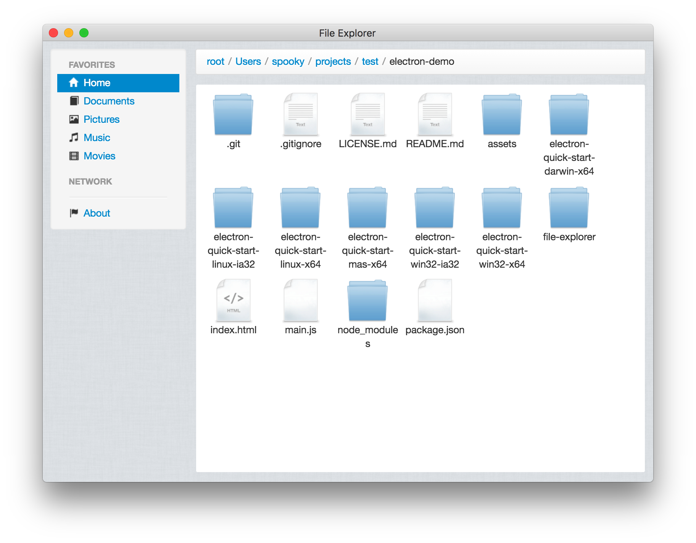

# Modern Web 2016: 15 分鐘 electron 初體驗

Electron 可以讓你使用純 JavaScript 使用豐富的原生 APIs 來創造桌面應用。你可以把它看作是用於 Desktop App 的 Node.js 的一個變體。這並不代表 Electron 是有自己 GUI 元件的 JavaScript。Electron 使用 Web 技術作為它的 GUI 的實作，所以你能把它看作成一個被 JavaScript 控制的精簡版的 Chromium 瀏覽器。

也就意味著，以往在開發 Desktop 時可能需要使用 Java、.Net 或是 Objective-C 相關技術來進行，有了 Electron 讓 Desktop App 的開發也能用熟悉的 Web 相關技術來進行，甚至 React, Angular 的前端框架也可以被引入 Electron 進行使用。

## 快速上手 - 檢測系統資訊

透過快速上手來了解 Electron 跟一般 Web 開發有什麼不同。

### 存取系統資訊

首先網頁應用通常是不能取用系統資訊的，基於安全性的考量，但 Electron 作為 Desktop App 表示其擁有更多存取權，首先透過下列指令來啟動第一個練習：

```bash
npm install && npm start
```

啟動畫面如下：



經由使用 Node.js 內建 [os](https://nodejs.org/api/os.html) module，可以存取系統網路、CPU、記憶體相關資訊。

### 練習：列出檔案系統

不管任何 OS 我們都可以透過 `ls` 來取得檔案系統，在 electron 我們可以透過 `ipc` 來進行顯示層與主執行緒進行溝通，我們可以想像成 Web 的前端透過 Ajax 來與後端 API 進行互動。

因此，第一步驟需要先宣告 IPC API，打開 `main.js`，可以看到

```
ipcMain.on('get ls result', function(event, arg) {
  // var cmd = 'ls';
  // exec(cmd, function(error, stdout, stderr) {
  //   event.returnValue = stdout;
  // });
});
```
`get ls result` 就是 API 的識別，把註解打開即完成程式撰寫。

第二步驟我們在打開 index.html 編寫：

```
function getFileSystemResilt(){
  // var result = ipcRenderer.sendSync('get ls result');
  // document.getElementById("result").innerHTML = result;
}
```
透過 `ipcRenderer.sendSync('get ls result')` 呼叫 api 取的結果，接著顯示在 Html，打開註解即完成。

執行結果如下：



透過此練習可以了解到透過 IPC 即使對 Terminal 下指令也不是問題。

## package 不同 OS 之 執行檔

既然作為 Desktop App 的應用，所以也可以打包為單一執行檔，透過下列指令

```
npm run build
```

可以打包成各種平台對應的安裝檔，如下：

```
# Linux
/home/user/workspace/electron-demo/electron-quick-start-linux-ia32
/home/user/workspace/electron-demo/electron-quick-start-linux-x64

# Windows
/home/user/workspace/electron-demo/electron-quick-start-win32-ia32
/home/user/workspace/electron-demo/electron-quick-start-win32-x64

# Mac OS X
/home/user/workspace/electron-demo/electron-quick-start-darwin-x64


```
將相關資料夾內得檔案複製到對應的執行平台，點選 `electron-quick-start` 啟動打包好的程式，如此就可以快速完成應用程式發布。

此練習為的執行環境為 ubuntu 64 bit，可以進入

`/home/user/workspace/electron-demo/electron-quick-start-linux-x64`

啟動應用程式，執行畫面如下：



## 執行 file file-explorer

在此專案根目錄執行：

`electron file-explorer/`

畫面如下：



除了基本的操作，也可以使用 Electron 建立如同 file explorer 的功能

## 其他使用 Election 製作的 App

* [Atom 編輯器](https://atom.io/)

  Electron 為 GitHub 為了開發 Atom 編輯器所開發出來的。

* [Nylas N1](https://nylas.com/)

  Email 管理軟體。

* [Kitematic](https://kitematic.com/)

  Docker 管理工具。


* [Slack](https://slack.com/)

  團隊通訊溝通軟體。
