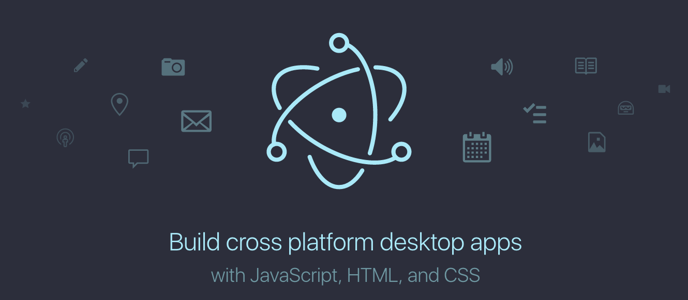

# Modern Web 2016：Electron Dojo

JavaScript 不只可以用於前端開發，也能用 Node.js 開發 Server-side 的後端程式，同時還能用 Electron 打造桌面應用程式，Electron 以 Chromium（WebKit）與 Node.js 為基礎，利用 HTML、CSS 與 JavaScript 等大家熟悉的 Web-based 技術，就能開發 Windows、Linux 與 Mac OS X 的跨平台桌面應用程式，透過這次的 Electron Dojo 將讓您體驗使用 Web 相關技術輕鬆打造桌面應用程式的樂趣。

## Electron 簡介

Electron 可以讓你使用純 JavaScript 使用豐富的原生 APIs 來創造桌面應用。你可以把它看作是用於 Desktop App 的 Node.js 的一個變體。這並不代表 Electron 是有自己 GUI 元件的 JavaScript。Electron 使用 Web 技術作為它的 GUI 的實作，所以你能把它看作成一個被 JavaScript 控制的精簡版的 Chromium 瀏覽器。

也就意味著，以往在開發 Desktop 時可能需要使用 Java、.Net 或是 Objective-C 相關技術來進行，有了 Electron 讓 Desktop App 的開發也能用熟悉的 Web 相關技術來進行，甚至 React, Angular 的前端框架也可以被引入 Electron 進行使用。

