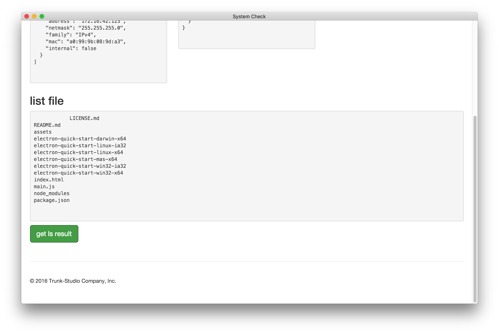

### 實作列出檔案

不管任何 OS 我們都可以透過 `ls` 來取得檔案系統，在 electron 我們可以透過 `ipc` 來進行顯示層與主執行緒進行溝通，我們可以想像成 Web 的前端透過 Ajax 來與後端 API 進行互動。

因此，第一步驟需要先宣告 IPC API，打開 `main.js`，可以看到

```
ipcMain.on('get ls result', function(event, arg) {
  // var cmd = 'ls';
  // exec(cmd, function(error, stdout, stderr) {
  //   event.returnValue = stdout;
  // });
});
```
`get ls result` 就是 API 的識別，把註解打開即完成程式撰寫。

第二步驟我們在打開 index.html 編寫：

```
function getFileSystemResilt(){
  // var result = ipcRenderer.sendSync('get ls result');
  // document.getElementById("result").innerHTML = result;
}
```
透過 `ipcRenderer.sendSync('get ls result')` 呼叫 api 取的結果，接著顯示在 Html，打開註解即完成。

執行結果如下：



透過此練習可以了解到透過 IPC 即使對 Terminal 下指令也不是問題，原本在 Browser 上做不到的事情，在 Electron 可以更進一步存取系統相關的資源。
