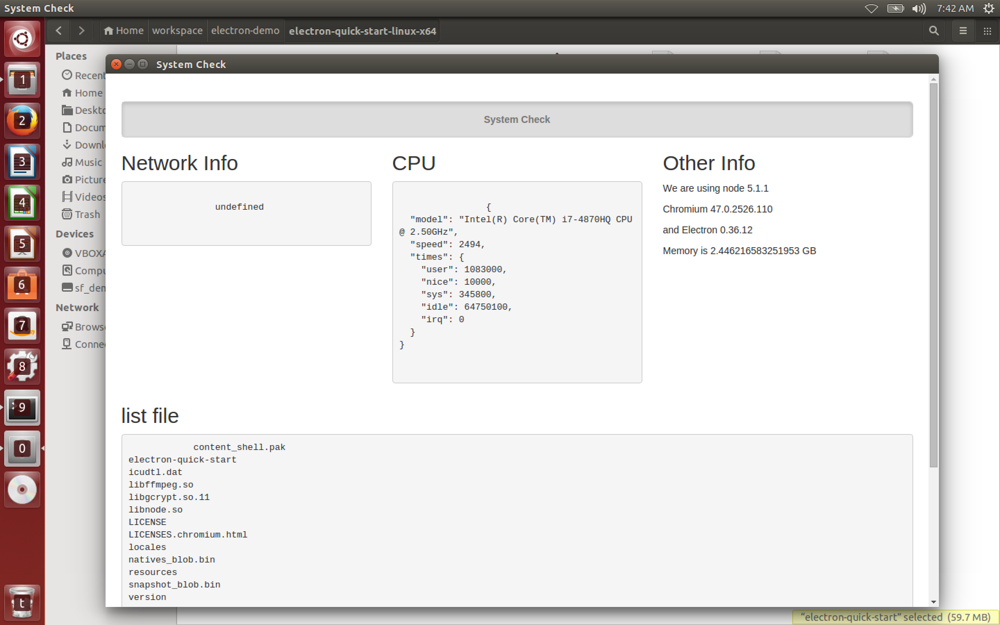
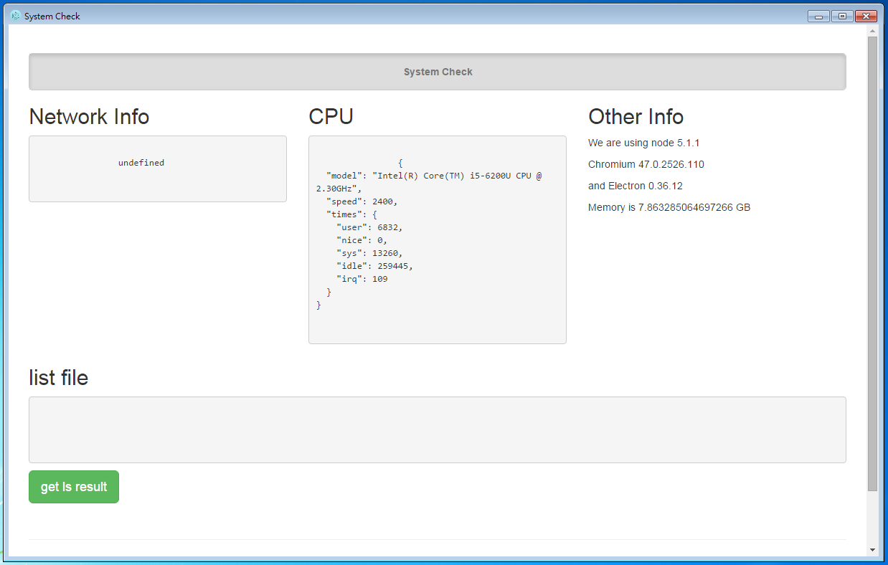

## 建置不同 OS 之執行檔

既然作為 Desktop App 的應用，所以也可以打包為單一執行檔，透過下列指令：

```
npm run build
```

可以打包成各種平台對應的安裝檔，如下：

```
# Linux
/home/user/workspace/electron-demo/electron-quick-start-linux-ia32
/home/user/workspace/electron-demo/electron-quick-start-linux-x64

# Windows
/home/user/workspace/electron-demo/electron-quick-start-win32-ia32
/home/user/workspace/electron-demo/electron-quick-start-win32-x64

# Mac OS X
/home/user/workspace/electron-demo/electron-quick-start-darwin-x64

```

將相關資料夾內得檔案複製到對應的執行平台，點選 `electron-quick-start` 啟動打包好的程式，如此就可以快速完成應用程式發布。

在此練習，我們可以試著執行 ubuntu、Windows 版本所打包好的執行檔，接著執行下面指令

```
npm run deploy
```

## Ubuntu

此練習所使用的 VM 執行環境為 ubuntu 64 bit，可以進入

桌面之 `electron-quick-start-linux-x64` 點選 `electron-quick-start` 啟動

啟動應用程式，執行畫面如下：



## Windows

在練習環境之主系統 Windows 桌面之 `demo` 捷徑，點選後可以看到資料夾 `electron-quick-start-win32-x64` 進入後同樣點選 `electron-quick-start` 進行啟動

啟動應用程式，執行畫面如下：


