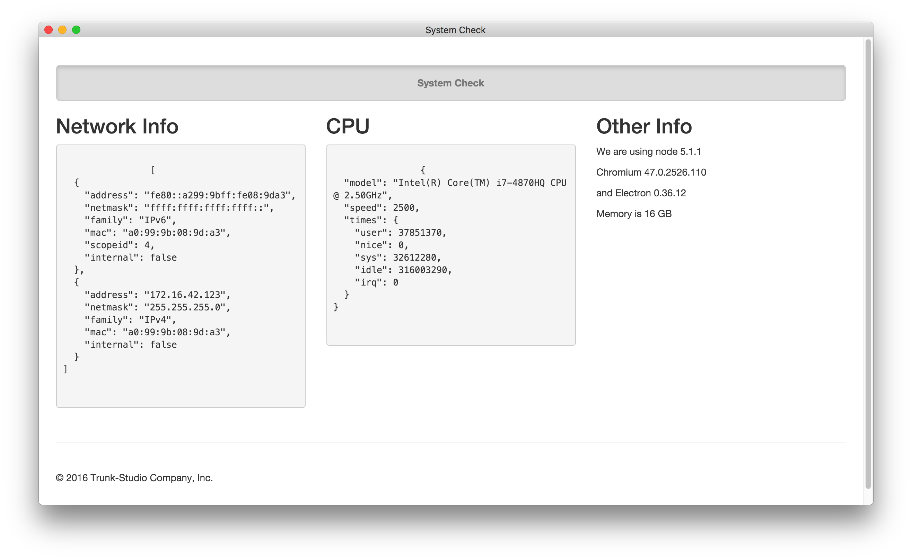

## 快速上手 - 檢測系統資訊

透過快速上手來了解 Electron 跟一般 Web 開發有什麼不同。

### 存取系統資訊

首先網頁應用通常是不能取用系統資訊的，基於安全性的考量，但 Electron 作為 Desktop App 表示其擁有更多存取權，首先透過下列指令來啟動第一個練習：

```bash
npm start
```

啟動畫面如下：



經由使用 Node.js 內建 [os](https://nodejs.org/api/os.html) module，可以存取系統網路、CPU、記憶體相關資訊。
